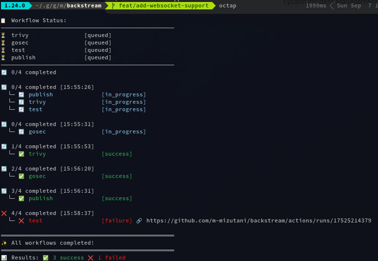

# octap
[](https://github.com/m-mizutani/octap/actions/workflows/test.yml) [](https://github.com/m-mizutani/octap/actions/workflows/lint.yml) [](https://github.com/m-mizutani/octap/actions/workflows/gosec.yml) [](https://github.com/m-mizutani/octap/actions/workflows/trivy.yml) [](https://github.com/m-mizutani/octap/actions/workflows/codeql.yml) [](https://goreportcard.com/report/github.com/m-mizutani/octap)

CLI GitHub Actions notifier - Monitor and notify when GitHub Actions workflows complete.



## Features

- 🔄 **Real-time monitoring** of GitHub Actions workflows
- 🎯 **Commit-specific tracking** - Monitor workflows for specific commits
- 🔔 **Sound notifications** - Different sounds for success/failure
- 📊 **Live CUI display** - See workflow status in real-time
- ⏱️ **Configurable polling** - Adjust check intervals
- 🔐 **Secure authentication** - GitHub OAuth Device Flow (no token management needed)
- ⚙️ **Customizable hooks** - Configure custom actions via YAML config file
- 🎵 **Custom sounds** - Use your own sound files for notifications
- 💬 **Desktop notifications** - Native OS notifications support

## Installation

### Using Go

```bash
go install github.com/m-mizutani/octap@latest
```

### From source

```bash
git clone https://github.com/m-mizutani/octap.git
cd octap
go build -o octap .
```

## Usage

### Basic usage

Monitor GitHub Actions for the current commit in the current directory:

```bash
octap
```

This will:
- Automatically detect the current Git repository and commit SHA
- Display real-time workflow status updates
- Play sound notifications when workflows complete
- Show detailed URLs for failed workflows

### Example Output

```
📋 Workflow Status:
──────────────────────────────────────────────────
✅ build                [success]
❌ test                 [failure] 🔗 https://github.com/user/repo/actions/runs/123456789
🔄 lint                 [in_progress]
⏳ deploy               [queued]
──────────────────────────────────────────────────
🔄 2/4 completed [15:47:30]

⏱️  Next check in: 5s
```

### Monitor specific commit

```bash
octap -c abc123def
```

### Adjust polling interval

```bash
# Default is 5 seconds
octap

# Check every 30 seconds
octap -i 30s

# Check every 2 minutes
octap -i 2m
```

### Disable sound notifications

```bash
octap --silent
```

### Verbose logging

```bash
# Show more detailed information
octap --verbose

# Show debug information including API calls
octap --debug
```

### Typical Workflow

1. **Push commits to GitHub**:
   ```bash
   git push origin feature-branch
   ```

2. **Monitor the workflows**:
   ```bash
   octap
   ```

3. **octap will**:
   - Authenticate with GitHub (first time only)
   - Monitor all workflows for your current commit
   - Show real-time updates as workflows progress
   - Play sounds when workflows complete (success/failure)
   - Display URLs for failed workflows so you can quickly investigate
   - Exit automatically when all workflows complete

## Authentication

octap uses GitHub OAuth Device Flow for authentication. On first run:

1. You'll receive a code to copy
2. Visit the provided GitHub URL  
3. Paste the code and authorize the app
4. octap will automatically complete the authentication

The token is stored locally at `~/.config/octap/token.json`.

### First-time Authentication Example

```
🔐 GitHub Device Flow Authentication
────────────────────────────────────
1. Copy this code: ABCD-1234
2. Visit: https://github.com/login/device
3. Paste the code and authorize the app

⏳ Waiting for authorization...
✅ Authentication successful!
```

### Using Your Own GitHub OAuth App

By default, octap uses a built-in OAuth Client ID for convenience. For production use or if you encounter rate limiting, you can create and use your own GitHub OAuth App:

1. **Create a GitHub OAuth App**:
   - Go to GitHub Settings → Developer settings → OAuth Apps
   - Click "New OAuth App"
   - Fill in the details:
     - Application name: Your app name (e.g., "My octap")
     - Homepage URL: Any valid URL (e.g., "https://github.com/yourusername/octap")
     - Authorization callback URL: `http://localhost` (not used but required)
   - Click "Register application"

2. **Use your Client ID**:
   ```bash
   # Set via environment variable
   export OCTAP_GITHUB_OAUTH_CLIENT_ID=your_client_id_here
   octap
   
   # Or pass directly via flag
   octap --github-oauth-client-id=your_client_id_here
   ```

**Note**: The Client Secret is not needed for Device Flow authentication.

## Configuration

### Command-line flags

| Flag | Description | Default | Example |
|------|-------------|---------|---------|
| `-c, --commit` | Specify commit SHA to monitor | Current HEAD | `octap -c abc123def` |
| `-i, --interval` | Polling interval | 5s | `octap -i 30s` |
| `--config` | Path to configuration file | `~/.config/octap/config.yml` | `octap --config ./my-config.yml` |
| `--silent` | Disable sound notifications | false | `octap --silent` |
| `--verbose` | Enable verbose logging | false | `octap --verbose` |
| `--debug` | Enable debug logging | false | `octap --debug` |
| `--github-oauth-client-id` | GitHub OAuth App Client ID | Built-in ID | `octap --github-oauth-client-id=Ov23...` |

**Environment Variables**:
- `OCTAP_GITHUB_OAUTH_CLIENT_ID`: Sets the GitHub OAuth App Client ID

### Configuration File

octap supports a YAML configuration file for customizing notifications and actions. By default, it looks for `~/.config/octap/config.yml`.

#### Generate Configuration Template

```bash
# Generate default config file
octap config init

# Generate config at specific location
octap config init --output ./my-config.yml

# Force overwrite existing config
octap config init --force
```

#### Configuration Example

The generated template includes OS-specific default sound files:

**macOS:**
```yaml
hooks:
  check_success:
    - type: sound
      path: /System/Library/Sounds/Glass.aiff
  
  check_failure:
    - type: sound
      path: /System/Library/Sounds/Basso.aiff
    - type: notify
      title: "Build Failed"
      message: "Workflow {{.Workflow}} failed"
      sound: true
  
  complete_success:
    - type: notify
      message: "All workflows completed successfully!"
  
  complete_failure:
    - type: notify
      title: "Workflow Failed"
      message: "One or more workflows failed"
      sound: false
```

**Linux:**
```yaml
hooks:
  check_success:
    - type: sound
      path: /usr/share/sounds/freedesktop/stereo/complete.oga
  
  check_failure:
    - type: sound
      path: /usr/share/sounds/freedesktop/stereo/dialog-error.oga
    - type: notify
      title: "Build Failed"
      message: "Workflow {{.Workflow}} failed"
```

**Windows:**
```yaml
hooks:
  check_success:
    - type: sound
      path: C:\Windows\Media\chimes.wav
  
  check_failure:
    - type: sound
      path: C:\Windows\Media\chord.wav
    - type: notify
      title: "Build Failed"
      message: "Workflow {{.Workflow}} failed"
```

#### Hook Events

| Event | Description |
|-------|-------------|
| `check_success` | Triggered when an individual workflow succeeds |
| `check_failure` | Triggered when an individual workflow fails |
| `complete_success` | Triggered when all workflows complete successfully |
| `complete_failure` | Triggered when any workflow fails |

#### Action Types

**`sound` Action**:
- `path`: Path to sound file (mp3, wav, aiff, m4a)

**`notify` Action**:
- `title`: Notification title (optional, default: "octap")
- `message`: Notification message (required)
- `sound`: Play notification sound (optional, default: true)

Template variables available in messages:
- `{{.Repository}}`: Repository name
- `{{.Workflow}}`: Workflow name
- `{{.URL}}`: Workflow URL

### Sound Notifications

When no configuration file is provided, octap plays different system sounds based on workflow results:

- **Success**: Glass sound (macOS), complete sound (Linux)
- **Failure**: Basso sound (macOS), error sound (Linux)
- **Final Summary**: Plays appropriate sound based on overall result

Sound notifications are automatically disabled on Windows or unsupported platforms.

### Workflow Status Icons

| Icon | Status | Description |
|------|--------|-------------|
| ⏳ | queued | Workflow is waiting to start |
| 🔄 | in_progress | Workflow is currently running |
| ✅ | success | Workflow completed successfully |
| ❌ | failure | Workflow failed (includes URL for investigation) |
| ⚪ | cancelled | Workflow was cancelled |
| ⏭️ | skipped | Workflow was skipped |

## Requirements

- **Git repository**: Must be run inside a Git repository with GitHub remote
- **Pushed commits**: The commit you want to monitor must be pushed to GitHub
- **Internet connection**: Required for GitHub API access

## Troubleshooting

### Common Issues

**"Current commit has not been pushed to GitHub"**
```bash
git push origin your-branch
```

**"failed to get repository info"**
- Ensure you're in a Git repository with a GitHub remote
- Check that the remote URL is accessible

**"No saved token found, starting authentication"**
- This is normal on first run, follow the authentication flow

### Supported Platforms

- **macOS**: Full support with system sounds
- **Linux**: Full support with system sounds (requires `paplay` or `aplay`)
- **Windows**: Visual monitoring only (sound notifications disabled)

## License

MIT License - see [LICENSE](LICENSE) file for details.

## Author

Masayuki Mizutani ([@m-mizutani](https://github.com/m-mizutani))